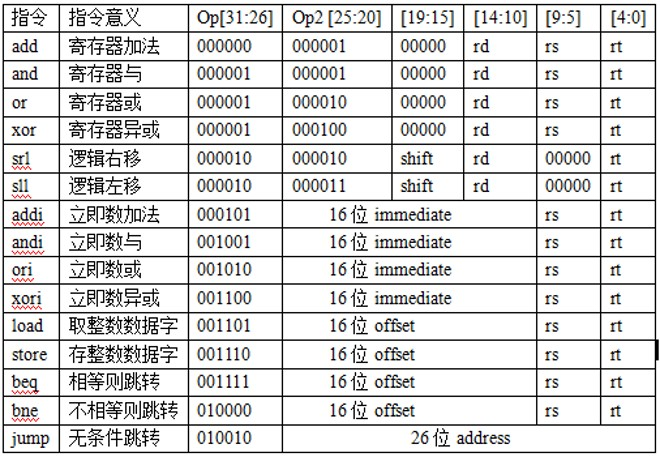

# auto_ ins
体系机构实验每次手动计算指令的16进制序列太麻烦，所以写了一个程序来执行，直接运行main.py即可。
## 指令输入格式
- 按照图中的格式即可
- 注意立即数要写成十进制不用加多余的符号
- 不要尝试负数，因为没有测试，实验中也没有类似要求

## 代码格式
- 最终一定会得到一个长度为8的16进制指令串

## 管理命令
- bye命令 
退出程序
- clear命令 
清屏
## 示例

